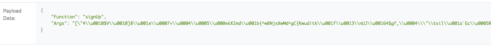
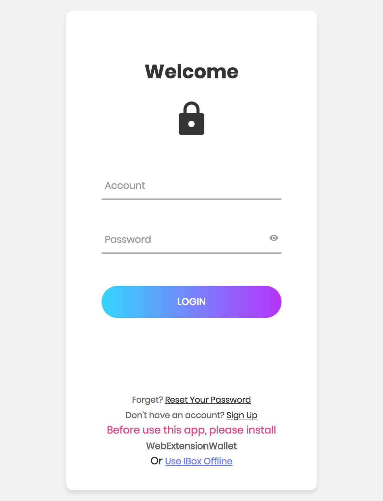
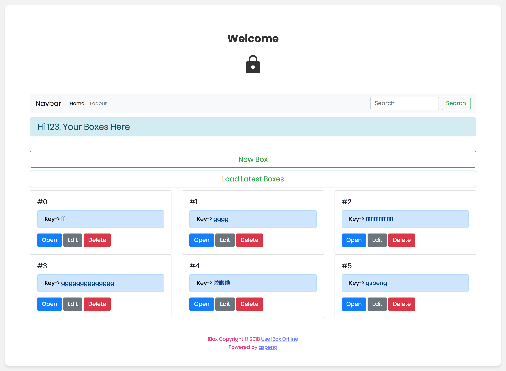

### IBox(私密保险柜) V1.0
>基于[星云链1.0 - 鹰星云](https://nebulas.io/index.html)
1. 利用区块链分布式存储的特性，使您的数据存储在链上后，永不丢失
2. 加密数据传输，避免区块链浏览器上泄露您的信息
3. 可离线使用，下载此`repo`，打开`index.html`即可
4. 使用之前，请下载浏览器钱包插件:[WebExtensionWallet](https://github.com/ChengOrangeJu/WebExtensionWallet)
5. 请注意备份您的`retrieveKey`, 当您忘记密码的时候，这是唯一能重置密码的方法
6. 实现了`Session` 机制，一段时间后，会话自动过期
7. 页面采用 `Material UI`, 简洁大方

---

---

---

